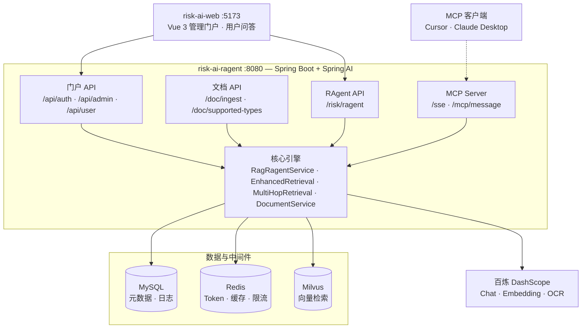

<p align="center">
  <strong>企业级 RAG 风控知识库</strong><br/>
  <sub>Risk AI RAGENT — 文档入库 · 向量检索 · 智能问答 · 管理门户</sub>
</p>


<p align="center">
  
  
  
  
  
  
  
</p>

## 什么是 Risk AI RAGENT？

**Risk AI RAGENT** 是一套面向金融风控场景的企业级 RAG 智能问答系统，覆盖从文档入库到门户问答的完整链路。后端 **Spring Boot 3.4.5 + Spring AI 1.0.0**，前端配套 **Vue 3 管理门户**（仓库 [`risk-ai-web`](../risk-ai-web)）。

- **知识库入库**：Apache Tika 解析主流办公文档 + 百炼视觉 OCR 识别图片 → jtokkit **800 Token 切片 / 150 Token 重叠** → 百炼 Embedding → Milvus 向量存储。
- **RAG 智能问答**：混合检索（向量 + BM25/RRF）+ **Rerank 精排** + 可选**多跳检索** → 风控 Prompt 强约束 → 千问大模型生成答案。
- **生产级能力**：Redis **答案缓存**、IP **限流**、大模型异常 **服务降级**、问答全链路 **MySQL 日志**。
- **MCP 对外暴露**：Spring AI MCP Server，供 Cursor / Claude 等客户端调用风控 RAG 工具。
- **企业门户**：管理员后台（用户/分类/文档/仪表盘/问答测试）+ 普通用户端（智能问答/会话历史/个人中心），Token 鉴权 + 角色隔离。

> 不是调个 API 的 Demo，而是包含鉴权、会话、分类、文档管理、缓存限流等工程能力的可运行系统。

## 快速导航

| | 链接 | 说明 |
| :---: | :--- | :--- |
| 📖 | [快速理解代码](docs/快速理解代码.md) | 后端模块与调用链导读 |
| 🏗️ | [RAG 架构说明](docs/RAG架构说明.md) | 三大 RAG 架构定位与本项目分层 |
| 📄 | [文档入库指南](docs/文档入库指南.md) | 多格式上传、Tika、图片 OCR、模型选型 |
| 🔌 | [MCP 接入指南](docs/MCP接入指南.md) | Cursor / Claude 调用风控 RAG 工具 |
| 🔁 | [多跳检索指南](docs/多跳检索指南.md) | Multi-hop 检索原理与配置 |
| 🔀 | [混合检索与 Rerank 指南](docs/混合检索与Rerank指南.md) | 混合召回、RRF 融合、精排配置与排错 |
| 🛠️ | [Windows 本地启动与排错](docs/Windows本地启动与排错.md) | Docker / WSL / 端口 / Embedding 404 等 |
| 🔧 | [application.yml](src/main/resources/application.yml) | 全部可调参数与环境变量 |
| 📋 | [.env.example](.env.example) | 本地密钥与中间件配置模板 |

## 系统架构

采用**四层分层**视图：展示层 → 应用层 → 数据层 → 模型服务。自上而下阅读即可。



| 层级 | 组件 | 职责 |
| :--- | :--- | :--- |
| 展示层 | `risk-ai-web` | 管理后台（用户/分类/文档/仪表盘）与用户端（问答/会话） |
| 应用层 | 门户 API | Token 鉴权、角色隔离、会话与文档管理 |
| | 文档 API | 多格式解析、OCR、切片向量化入库 |
| | RAgent API | RAG 检索 + 风控 Prompt + 缓存/限流/降级 |
| | MCP Server | 对外暴露检索、问答、统计等工具 |
| 数据层 | MySQL / Redis / Milvus | 业务元数据、缓存与限流、向量相似度检索 |
| 模型层 | 百炼 DashScope | 对话生成、Embedding、图片 OCR、**Rerank 精排** |

> **RAG 架构定位**：本项目属于 **Advanced RAG**（混合检索 + Rerank + 可选多跳），详见 [RAG 架构说明](docs/RAG架构说明.md)。

### 一次问答的核心链路

```
用户提问
  → 鉴权（Redis Token）
  → 答案缓存查询（Redis，MD5 Key）
  → 检索编排（见 risk-ai.multi-hop / risk-ai.retrieval 配置）
      · 向量召回（Milvus，candidate-top-k）+ 关键词召回（Redis BM25，默认开启）
      · RRF 融合 → qwen3-rerank 精排 → final top-k
      · 可选多跳：原问题 → 子查询 → 合并后再混合 + Rerank
  → 组装风控 System Prompt + 检索上下文
  → 百炼千问生成回答
  → 引用按文档名去重
  → 写入 chat_message / ragent_log，返回答案与引用（含 multiHopUsed / hybridRetrievalUsed / rerankUsed）
```

### 文档入库链路

```
上传文件（管理后台 / POST /doc/ingest）
  → 扩展名校验（SupportedDocumentTypes）
  → 分支解析
      · 办公文档 / PDF / 文本 → Tika AutoDetectParser
      · 图片 → 百炼视觉 OCR（risk-ai.document.vision-model）
  → Token 切片（800 / 150 重叠）
  → DashScope text-embedding-v4 向量化
  → 写入 Milvus + Redis 关键词索引 + MySQL 文档元数据
  → Redis 记录 chunk ID（支持一键清空）
```

详见 [文档入库指南](docs/文档入库指南.md)。

## 功能模块

### 1. 知识库文档解析入库

| 能力 | 说明 |
| --- | --- |
| 格式支持 | **文本**：TXT、MD、CSV、JSON、XML、HTML 等 |
| | **PDF** |
| | **Office**：DOC、DOCX、XLS、XLSX、PPT、PPTX、RTF、ODT/ODS/ODP |
| | **图片**：JPG、PNG、GIF、BMP、WEBP、TIFF（百炼视觉 OCR，默认 `qwen-vl-plus`） |
| | **其他**：EPUB |
| 解析方式 | Tika `AutoDetectParser` / 视觉 OCR（`risk-ai.document.*`） |
| OCR 模型 | 可配置：`qwen-vl-plus`、`qwen-vl-ocr-latest`、`vanchin/deepseek-ocr` 等 |
| 格式查询 | `GET /doc/supported-types` |
| 切片策略 | 800 Token / 片，150 Token 重叠（jtokkit） |
| 向量存储 | Milvus，`text-embedding-v4`（1024 维） |
| 分类管理 | 文档可绑定知识分类，检索时可按分类过滤 |
| 清空重建 | `DELETE /doc/clear` 或管理端操作 |

详见 [文档入库指南](docs/文档入库指南.md)。

### 2. RAG 智能问答

| 能力 | 说明 |
| --- | --- |
| 检索 | **混合检索**：Milvus 向量 + Redis BM25 关键词，RRF 融合（默认开启） |
| **Rerank 精排** | 百炼 `qwen3-rerank` 对候选文档二次排序（默认开启） |
| **多跳检索** | 可选开启：第 1 跳原问题 → LLM/规则生成子查询 → 多跳合并后再混合 + Rerank（默认关闭） |
| 防幻觉 | 风控 System Prompt：无依据则回复「暂无相关风控规则信息」 |
| 引用溯源 | 返回答案关联的知识片段（按 source 去重） |
| 分类过滤 | 用户可选择知识分类范围提问 |

详见 [混合检索与 Rerank 指南](docs/混合检索与Rerank指南.md)、[RAG 架构说明](docs/RAG架构说明.md)。

### 3. MCP Server（Model Context Protocol）

| 能力 | 说明 |
| --- | --- |
| 传输 | SSE（`/sse` + `/mcp/message`），Spring AI MCP WebMVC |
| 工具 | `searchRiskKnowledge`、`askRiskQuestion`、`getKnowledgeBaseStats`、`listKnowledgeCategories` |
| 客户端 | Cursor、Claude Desktop（经 mcp-remote）等 |
| 鉴权 | MCP 端点不走 `/api/**` Token 拦截，生产环境建议网关限流 |

详见 [MCP 接入指南](docs/MCP接入指南.md)。

### 4. Redis 限流 + 缓存 + 降级

| 能力 | 说明 |
| --- | --- |
| 限流 | `@RateLimit` + AOP + Lua 固定窗口，默认 20 次/60s/IP |
| 缓存 | 问题 MD5 → 答案缓存，默认 TTL 60 分钟 |
| 降级 | 大模型不可用时返回兜底文案，`degraded=true` |

### 5. 数据持久化与门户

| 表 | 用途 |
| --- | --- |
| `ragent_log` | 开放 API 问答日志（traceId、耗时、是否缓存/降级） |
| `sys_user` | 用户账号（admin / user 角色） |
| `sys_category` | 知识分类 |
| `sys_document` | 已上传文档元数据 |
| `chat_session` / `chat_message` | 用户多轮会话与历史 |

## 技术栈

> **版本以项目文件为准**（`pom.xml` / `package.json` / `docker-compose.yml` / `application.yml`），下表已与源码核对。

### 版本清单

| 类别 | 组件 | 锁定版本 | 定义位置 |
| --- | --- | --- | --- |
| 后端运行时 | JDK | **17** | `pom.xml` → `java.version` |
| 后端框架 | Spring Boot | **3.4.5** | `pom.xml` → `spring-boot-starter-parent` |
| AI 框架 | Spring AI BOM | **1.0.0** | `pom.xml` → `spring-ai.version` |
| AI 依赖 | spring-ai-starter-model-openai | **1.0.0** | Maven 解析 |
| AI 依赖 | spring-ai-starter-vector-store-milvus | **1.0.0** | Maven 解析 |
| AI 依赖 | spring-ai-starter-mcp-server-webmvc | **1.0.0** | MCP Server |
| ORM | MyBatis-Plus | **3.5.16** | `pom.xml` |
| API 文档 | springdoc-openapi | **2.8.5** | `pom.xml` |
| 文档解析 | Apache Tika | **3.2.3** | `pom.xml` |
| 分词计数 | jtokkit | **1.1.0** | `pom.xml` |
| 大模型 Chat | 千问 `qwen-plus` | 默认 | `application.yml` |
| 大模型 Embedding | `text-embedding-v4` | 默认 | `application.yml` |
| 向量维度 | Milvus embedding dim | **1024** | `application.yml` |
| 中间件 | MySQL | **8.0** | `docker-compose.yml` |
| 中间件 | Redis | **7.2** | `docker-compose.yml` |
| 中间件 | Milvus | **2.3.9** | `docker-compose.yml` |
| 前端 | Vue | **3.5.x** | `risk-ai-web/package.json` |
| 前端 | Vite | **5.4.x** | `risk-ai-web/package.json` |
| 前端 | Element Plus | **2.8.x** | `risk-ai-web/package.json` |
| 前端 | Pinia | **2.2.x** | `risk-ai-web/package.json` |
| 前端 | ECharts | **5.5.x** | `risk-ai-web/package.json` |

### 后端（risk-ai-ragent）

| 组件 | 选型 | 说明 |
| --- | --- | --- |
| JDK | **Java 17** | |
| 框架 | **Spring Boot 3.4.5** | `spring-boot-starter-parent` |
| AI | **Spring AI 1.0.0** | BOM 管理；OpenAI 兼容协议对接百炼 DashScope |
| 大模型 | **千问 qwen-plus** | Chat；Embedding 用 `text-embedding-v4` |
| 向量库 | **Milvus 2.3.9** | Collection：`risk_knowledge` |
| 缓存/限流 | **Redis 7.2** | 答案缓存、Token、IP 限流 |
| 关系库 | **MySQL 8.0** | 业务数据 + 问答日志 |
| ORM | **MyBatis-Plus 3.5.16** | 分页、逻辑删除 |
| 文档解析 | **Apache Tika 3.2.3** | |
| 分词计数 | **jtokkit 1.1.0** | Token 级切片 |
| API 文档 | **springdoc-openapi 2.8.5** | Swagger UI |

### 前端（risk-ai-web）

| 组件 | 选型 |
| --- | --- |
| 框架 | Vue **3.5.12** + Vite **5.4.10** |
| UI | Element Plus **2.8.4** |
| 状态 | Pinia **2.2.4** |
| 路由 | Vue Router **4.4.5** |
| HTTP | Axios **1.7.7** |
| 图表 | ECharts **5.5.1**（管理仪表盘） |

### 版本说明

| 文档 | Spring Boot | Spring AI |
| --- | --- | --- |
| **本项目实际构建** | **3.4.5**   | **1.0.0** |

Spring AI **1.0.0 GA** 要求 Spring Boot **3.4+**；在 Boot 3.2 上可用的 Spring AI 0.8.x 在当前 Maven 镜像环境难以拉取。因此 `pom.xml` 采用 **Boot 3.4.5 + Spring AI 1.0.0**（`mvn dependency:tree` 已验证）。

**请勿与参考模板 `md.md`（Ragent 项目，标注 Spring AI 2.0）混淆**——本仓库未使用 Spring AI 2.0。

## 目录结构

```
risk-ai-ragent/
├── src/main/java/com/gm/riskaiRagent/
│   ├── annotation/          @RateLimit
│   ├── aspect/              限流切面
│   ├── common/              统一响应、异常处理
│   ├── config/              RagProperties、Redis、MyBatis、鉴权初始化
│   ├── controller/
│   │   ├── DocController              /doc/*
│   │   ├── RiskRagentController           /risk/ragent
│   │   └── api/                       门户 API
│   │       ├── AuthController         /api/auth/*
│   │       ├── admin/                 管理端
│   │       └── user/                  用户端
│   ├── dto/ / entity/ / mapper/
│   ├── mcp/                 RiskMcpTools（MCP 工具）
│   ├── security/            AuthContext、Token 拦截
│   ├── service/             RAG、多跳检索、文档、会话、仪表盘等
│   └── util/                Tika 解析、格式白名单、Token 切片
├── src/main/resources/
│   ├── application.yml      主配置（密钥走环境变量）
│   └── schema.sql           建表脚本
├── docker-compose.yml       MySQL / Redis / Milvus
└── docs/                    开发与排错文档
    ├── 快速理解代码.md
    ├── 文档入库指南.md
    ├── MCP接入指南.md
    ├── 多跳检索指南.md
    ├── 混合检索与Rerank指南.md
    ├── RAG架构说明.md
    └── Windows本地启动与排错.md

risk-ai-web/                 前端门户（同级目录）
├── src/views/admin/         仪表盘、用户、分类、文档、问答测试
├── src/views/user/          智能问答、会话历史、个人中心
└── vite.config.js           开发代理 /api → :8080
```

## 快速开始

### 环境要求

| 组件 | 版本 |
| --- | --- |
| JDK | 17 |
| Maven | 3.8+ |
| Node.js | 18+（前端） |
| Docker Desktop + WSL2 | 运行 MySQL / Redis / Milvus |

### 1. 启动中间件

```powershell
cd risk-ai-ragent
docker compose up -d
```

| 服务 | 镜像版本 | 端口 |
| --- | --- | --- |
| MySQL | **8.0** | **3307** → 3306（避免与本机 3306 冲突） |
| Redis | **7.2** | 6379 |
| Milvus | **2.3.9** | 19530 |

### 2. 配置密钥（勿提交 Git）

```powershell
# 复制模板后填入真实 Key，或直接在 PowerShell 设置
$env:DASHSCOPE_API_KEY="your-dashscope-api-key"
$env:MYSQL_PORT="3307"
$env:MYSQL_PASSWORD="root"
```

详见 [.env.example](.env.example)。

### 3. 启动后端

```powershell
$env:JAVA_HOME="F:\tool\jdk-17.0.9"   # 按本机 JDK 17 路径修改
$env:PATH="$env:JAVA_HOME\bin;$env:PATH"
cd risk-ai-ragent
mvn spring-boot:run
```

- API：<http://localhost:8080>
- Swagger：<http://localhost:8080/swagger-ui.html>

### 4. 启动前端

```powershell
cd risk-ai-web
npm install
npm run dev
```

- 门户：<http://localhost:5173>

### 默认账号

| 角色 | 账号 | 密码 |
| --- | --- | --- |
| 管理员 | admin | 123456 |
| 普通用户 | user1 | 123456 |

## API 概览

统一响应：`{ "code": 200, "message": "success", "data": ... }`

### 开放接口（无需登录）

| 方法 | 路径 | 说明 |
| --- | --- | --- |
| POST | `/doc/ingest` | 文档入库（multipart，支持主流格式） |
| GET | `/doc/supported-types` | 查询支持的文件扩展名 |
| DELETE | `/doc/clear` | 清空向量库 |
| POST | `/risk/ragent` | 风控问答（含限流） |

### 门户接口（需 Token）

| 模块 | 前缀 | 说明 |
| --- | --- | --- |
| 认证 | `/api/auth/login` | 登录获取 Token |
| 管理端 | `/api/admin/*` | 用户、分类、文档、仪表盘、问答测试 |
| 用户端 | `/api/user/*` | 会话、聊天、个人资料 |

### 示例：风控问答

```bash
curl -X POST http://localhost:8080/risk/ragent \
  -H "Content-Type: application/json" \
  -d '{"question":"信用风险的常见缓释手段有哪些？","includeReferences":true}'
```

返回字段：`traceId` / `answer` / `references[]` / `fromCache` / `degraded` / `costMs` / `multiHopUsed` / `retrievalHops` / `hybridRetrievalUsed` / `rerankUsed`

### 示例：文档入库

```bash
# PDF / Word / Excel 等
curl -X POST http://localhost:8080/doc/ingest -F "file=@./风控制度.pdf"

# 图片（先 OCR 再切片向量化）
curl -X POST http://localhost:8080/doc/ingest -F "file=@./制度截图.png"

# 查询支持的格式
curl http://localhost:8080/doc/supported-types
```

入库响应含 `fileType`、`parseMode`（`TIKA` / `VISION_OCR`）。详见 [文档入库指南](docs/文档入库指南.md)。

### 示例：MCP 连接（Cursor）

```json
{
  "mcpServers": {
    "risk-ai-ragent": {
      "url": "http://localhost:8080/sse"
    }
  }
}
```

详见 [MCP 接入指南](docs/MCP接入指南.md)。

## 关键配置

`application.yml` → `risk-ai.*`（由 `RagProperties` 绑定）：

| 配置 | 默认 | 说明 |
| --- | --- | --- |
| `chunk.size` / `chunk.overlap` | 800 / 150 | Token 切片 |
| `rag.top-k` / `similarity-threshold` | 5 / 0.5 | 最终送入 LLM 的条数 / 向量相似度阈值 |
| `retrieval.hybrid.enabled` | **true** | 是否启用混合检索（向量 + BM25） |
| `retrieval.hybrid.candidate-top-k` | 20 | 向量/关键词各自召回候选数 |
| `retrieval.hybrid.rrf-k` | 60 | RRF 融合平滑常数 |
| `retrieval.rerank.enabled` | **true** | 是否启用 qwen3-rerank 精排 |
| `retrieval.rerank.model` | qwen3-rerank | Rerank 模型名 |
| `retrieval.rerank.fail-open` | true | Rerank 失败时回退到融合排序 |
| `multi-hop.enabled` | **false** | 是否启用多跳检索 |
| `multi-hop.max-hops` | 2 | 最大跳数（含第 1 跳） |
| `multi-hop.sub-queries-per-hop` | 2 | 每跳子查询数 |
| `multi-hop.hop-top-k` / `final-top-k` | 3 / 5 | 每跳 topK / 合并后保留数 |
| `multi-hop.use-llm-sub-query` | true | 用大模型生成子查询 |
| `document.vision-model` | qwen-vl-plus | 图片 OCR 模型（可改为 `qwen-vl-ocr-latest`） |
| `document.ocr-prompt` | … | 图片 OCR 提示词 |
| `cache.ttl-minutes` | 60 | 答案缓存时长 |
| `rate-limit.max-requests` / `window-seconds` | 20 / 60 | IP 限流 |
| `degrade.fallback-answer` | … | 降级兜底文案 |

大模型相关（环境变量）：

| 变量 | 说明 |
| --- | --- |
| `DASHSCOPE_API_KEY` | **必填**，百炼 API Key |
| `OPENAI_CHAT_MODEL` | 默认 `qwen-plus` |
| `OPENAI_EMBEDDING_MODEL` | 默认 `text-embedding-v4` |
| `RISK_AI_VISION_MODEL` | 图片 OCR 模型，默认 `qwen-vl-plus` |
| `RISK_AI_RERANK_MODEL` | Rerank 模型，默认 `qwen3-rerank` |
| `MILVUS_DIM` | 默认 `1024`，须与 Embedding 模型一致 |

MCP 相关（`spring.ai.mcp.server.*`）：

| 配置 | 默认 | 说明 |
| --- | --- | --- |
| `enabled` | true | 是否启用 MCP Server |
| `sse-endpoint` | `/sse` | SSE 连接端点 |
| `sse-message-endpoint` | `/mcp/message` | 消息端点 |

## 防幻觉策略

`RagRagentService` 内置风控 System Prompt，核心规则：

1. 回答必须 **100% 溯源** 检索到的参考文档；
2. 文档无对应信息时，统一回复 **「暂无相关风控规则信息」**；
3. 禁止编造、推演、猜测；
4. `temperature` 默认 **0.1**，降低发散。

## 与典型 Demo 的对比

| 对比维度 | 典型 RAG Demo | Risk AI Ragent |
| --- | --- | --- |
| 文档入库 | 脚本手动塞数据 | Tika 解析 + Token 切片 + 管理端上传 |
| 问答入口 | 单个 curl 接口 | 开放 API + 用户门户多轮会话 |
| 权限 | 无 | Redis Token + admin/user 角色 |
| 分类 | 无 | 知识分类管理与检索过滤 |
| 缓存限流 | 无 | Redis 缓存 + IP 限流 |
| 多跳检索 | 无 | 可配置 Multi-hop，跨文档补全上下文 |
| 混合检索 + Rerank | 无 | 向量 + BM25 混合召回，qwen3-rerank 精排 |
| MCP 对外 | 无 | SSE MCP Server，4 个风控工具 |
| 降级 | 报错即失败 | 大模型异常自动兜底 |
| 可观测 | 无 | ragent_log traceId + 耗时 + 缓存/降级标记 |
| 管理后台 | 无 | Vue 3 完整管理端 + 用户端 |

## 常见问题

<details>
<summary><b>Embedding 报 404？</b></summary>

`base-url` 已含 `/v1` 时，须配置：

```yaml
spring.ai.openai:
  base-url: https://dashscope.aliyuncs.com/compatible-mode/v1
  chat:
    completions-path: /chat/completions
  embedding:
    embeddings-path: /embeddings
```

详见 [Windows 本地启动与排错](docs/Windows本地启动与排错.md)。
</details>

<details>
<summary><b>MySQL 连接失败？</b></summary>

Docker MySQL 映射在 **3307**，密码为 **root**。启动后端前设置：

```powershell
$env:MYSQL_PORT="3307"
$env:MYSQL_PASSWORD="root"
```
</details>

<details>
<summary><b>引用显示两个相同文档？</b></summary>

同一文档会被切成多个 chunk，检索可能命中多段。后端与前端均已按 `source`（文件名）去重展示。
</details>

<details>
<summary><b>混合检索 / Rerank 不生效？历史文档搜不到？</b></summary>

关键词索引在**入库时**写入 Redis（`risk-ai:chunk:index`）。功能上线前已入库的文档需**重新上传**，或先 `DELETE /doc/clear` 再批量入库。

配置见 `risk-ai.retrieval.*`；Rerank 依赖 `DASHSCOPE_API_KEY`。详见 [混合检索与 Rerank 指南](docs/混合检索与Rerank指南.md)。
</details>

<details>
<summary><b>如何开启多跳检索？</b></summary>

在 `application.yml` 中设置：

```yaml
risk-ai:
  multi-hop:
    enabled: true
```

重启后 `/risk/ragent`、用户聊天、管理端问答测试均自动走多跳。默认 `false` 与改造前单跳行为一致。详见 [多跳检索指南](docs/多跳检索指南.md)。
</details>

<details>
<summary><b>管理端时间不显示或仪表盘统计为「-」？</b></summary>

前后端字段名不一致：列表用 `createdAt`，前端原绑定 `createTime`；仪表盘用 `users`/`documents`/`categories`，前端原绑定 `userCount` 等。已在 `risk-ai-web` 的 API 层做映射，更新前端后刷新即可。详见 [Windows 本地启动与排错](docs/Windows本地启动与排错.md) §3.12。
</details>

<details>
<summary><b>用户端能上传图片吗？如何检索图片内容？</b></summary>

不能。上传仅在**管理端 → 文档管理**；用户端只做**文字问答**。图片先由管理员上传并经 OCR 入库，用户选择对应分类后用文字提问即可检索，**不是以图搜图**。详见 [Windows 本地启动与排错](docs/Windows本地启动与排错.md) §3.14。
</details>

<details>
<summary><b>问答提示「服务繁忙」？</b></summary>

表示大模型调用失败（`degraded=true`），多为 API Key 无效或百炼超时，与「不支持图片检索」无关。修复 Key 并重启后端。详见 [Windows 本地启动与排错](docs/Windows本地启动与排错.md) §3.15。
</details>

<details>
<summary><b>图片上传后解析失败？</b></summary>

图片入库走百炼视觉 OCR（`risk-ai.document.vision-model`，默认 `qwen-vl-plus`），需确保 `DASHSCOPE_API_KEY` 有效且已开通对应模型。

- 若报 `invalid header value: "Bearer 你的key"`，说明 Key 仍是占位符，见 [排错指南](docs/Windows本地启动与排错.md) §3.13
- 扫描件、表格多：建议改为 `qwen-vl-ocr-latest`（`RISK_AI_VISION_MODEL` 环境变量）
- 复杂版式可试 `vanchin/deepseek-ocr`，**不必自建 DeepSeek-OCR**
- 图片检索是 OCR 成文字后再向量检索，不是以图搜图

详见 [文档入库指南](docs/文档入库指南.md)。
</details>

<details>
<summary><b>支持哪些文件格式？</b></summary>

TXT/MD/CSV、PDF、Word(DOC/DOCX)、Excel、PPT、图片(JPG/PNG 等)、EPUB。调用 `GET /doc/supported-types` 或查看 [文档入库指南](docs/文档入库指南.md)。
</details>

<details>
<summary><b>本机 Java 版本不对？</b></summary>

项目需要 **JDK 17**。若默认 `java` 为 1.8，请显式设置 `JAVA_HOME` 后再执行 `mvn`。
</details>

## 相关仓库

| 仓库 | 说明 |
| --- | --- |
| **risk-ai-ragent**（本仓库） | Spring Boot 后端 + RAG 核心 |
| **risk-ai-web** | Vue 3 前端门户 |

---

<p align="center">
  企业级 RAG 风控知识库 · 文档驱动 · 可溯源 · 可落地
</p>
