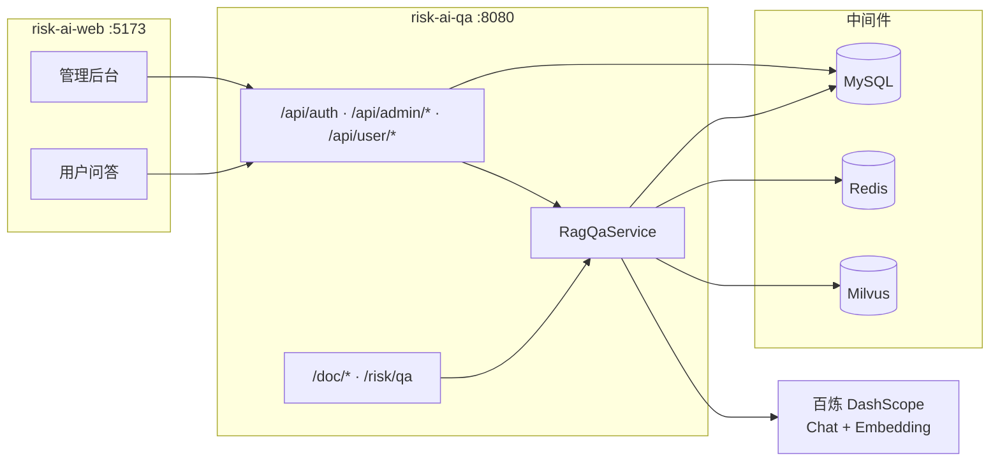

<p align="center">
  <strong>企业级 RAG 风控知识库</strong><br/>
  <sub>Risk AI Q&A — 文档入库 · 向量检索 · 智能问答 · 管理门户</sub>
</p>

<p align="center">
  
  
  
  
  
</p>

## 什么是 Risk AI Q&A？

**Risk AI Q&A** 是一套面向金融风控场景的企业级 RAG 智能问答系统，覆盖从文档入库到门户问答的完整链路。后端基于 **Spring Boot + Spring AI**，前端配套 **Vue 3 管理门户**（仓库 [`risk-ai-web`](../risk-ai-web)）。

- **知识库入库**：Apache Tika 解析 TXT/PDF → jtokkit **800 Token 切片 / 150 Token 重叠** → 百炼 Embedding → Milvus 向量存储。
- **RAG 智能问答**：向量相似度检索 → **风控 Prompt 强约束**（仅依据参考文档作答，禁止幻觉）→ 千问大模型生成答案。
- **生产级能力**：Redis **答案缓存**、IP **限流**、大模型异常 **服务降级**、问答全链路 **MySQL 日志**。
- **企业门户**：管理员后台（用户/分类/文档/仪表盘/问答测试）+ 普通用户端（智能问答/会话历史/个人中心），Token 鉴权 + 角色隔离。

> 不是调个 API 的 Demo，而是包含鉴权、会话、分类、文档管理、缓存限流等工程能力的可运行系统。

## 快速导航

| | 链接 | 说明 |
| :---: | :--- | :--- |
| 📖 | [快速理解代码](docs/快速理解代码.md) | 后端模块与调用链导读 |
| 🛠️ | [Windows 本地启动与排错](docs/Windows本地启动与排错.md) | Docker / WSL / 端口 / Embedding 404 等 |
| 🔧 | [application.yml](src/main/resources/application.yml) | 全部可调参数与环境变量 |
| 📋 | [.env.example](.env.example) | 本地密钥与中间件配置模板 |

## 系统架构



### 一次问答的核心链路

```
用户提问
  → 鉴权（Redis Token）
  → 答案缓存查询（Redis，MD5 Key）
  → Milvus 向量检索（topK + 相似度阈值 + 可选分类过滤）
  → 组装风控 System Prompt + 检索上下文
  → 百炼千问生成回答
  → 引用按文档名去重
  → 写入 chat_message / qa_log，返回答案与引用
```

### 文档入库链路

```
上传文件（管理后台 / POST /doc/ingest）
  → Tika 解析纯文本
  → Token 切片（800 / 150 重叠）
  → DashScope text-embedding-v4 向量化
  → 写入 Milvus + MySQL 文档元数据
  → Redis 记录 chunk ID（支持一键清空）
```

## 功能模块

### 1. 知识库文档解析入库

| 能力 | 说明 |
| --- | --- |
| 格式支持 | TXT、PDF（Tika 统一解析） |
| 切片策略 | 800 Token / 片，150 Token 重叠（jtokkit） |
| 向量存储 | Milvus，`text-embedding-v4`（1024 维） |
| 分类管理 | 文档可绑定知识分类，检索时可按分类过滤 |
| 清空重建 | `DELETE /doc/clear` 或管理端操作 |

### 2. RAG 智能问答

| 能力 | 说明 |
| --- | --- |
| 检索 | 向量相似度搜索，默认 topK=5，阈值 0.5 |
| 防幻觉 | 风控 System Prompt：无依据则回复「暂无相关风控规则信息」 |
| 引用溯源 | 返回答案关联的知识片段（按 source 去重） |
| 分类过滤 | 用户可选择知识分类范围提问 |

### 3. Redis 限流 + 缓存 + 降级

| 能力 | 说明 |
| --- | --- |
| 限流 | `@RateLimit` + AOP + Lua 固定窗口，默认 20 次/60s/IP |
| 缓存 | 问题 MD5 → 答案缓存，默认 TTL 60 分钟 |
| 降级 | 大模型不可用时返回兜底文案，`degraded=true` |

### 4. 数据持久化与门户

| 表 | 用途 |
| --- | --- |
| `qa_log` | 开放 API 问答日志（traceId、耗时、是否缓存/降级） |
| `sys_user` | 用户账号（admin / user 角色） |
| `sys_category` | 知识分类 |
| `sys_document` | 已上传文档元数据 |
| `chat_session` / `chat_message` | 用户多轮会话与历史 |

## 技术栈

### 后端（risk-ai-qa）

| 组件 | 选型 | 说明 |
| --- | --- | --- |
| JDK | **Java 17** | |
| 框架 | **Spring Boot 3.4.5** | |
| AI | **Spring AI 1.0.0** | OpenAI 兼容协议，对接百炼 DashScope |
| 大模型 | **千问 qwen-plus** | Chat；Embedding 用 `text-embedding-v4` |
| 向量库 | **Milvus 2.3.x** | Collection：`risk_knowledge` |
| 缓存/限流 | **Redis 7.x** | 答案缓存、Token、IP 限流 |
| 关系库 | **MySQL 8.x** | 业务数据 + 问答日志 |
| ORM | **MyBatis-Plus 3.5.16** | 分页、逻辑删除 |
| 文档解析 | **Apache Tika 3.2.3** | |
| 分词计数 | **jtokkit 1.1.0** | Token 级切片 |
| API 文档 | springdoc-openapi | Swagger UI |

### 前端（risk-ai-web）

| 组件 | 选型 |
| --- | --- |
| 框架 | Vue 3 + Vite |
| UI | Element Plus |
| 状态 | Pinia |
| 图表 | ECharts（管理仪表盘） |

### 版本说明

需求曾写 Spring Boot 3.2 + Spring AI，但 **Spring AI 1.0.x GA 要求 Boot 3.4+**。当前采用可稳定构建的组合：**Spring Boot 3.4.5 + Spring AI 1.0.0**。

## 目录结构

```
risk-ai-qa/
├── src/main/java/com/gm/riskaiqa/
│   ├── annotation/          @RateLimit
│   ├── aspect/              限流切面
│   ├── common/              统一响应、异常处理
│   ├── config/              RagProperties、Redis、MyBatis、鉴权初始化
│   ├── controller/
│   │   ├── DocController              /doc/*
│   │   ├── RiskQaController           /risk/qa
│   │   └── api/                       门户 API
│   │       ├── AuthController         /api/auth/*
│   │       ├── admin/                 管理端
│   │       └── user/                  用户端
│   ├── dto/ / entity/ / mapper/
│   ├── security/            AuthContext、Token 拦截
│   ├── service/             RAG、文档、会话、仪表盘等
│   └── util/                Tika 解析、Token 切片
├── src/main/resources/
│   ├── application.yml      主配置（密钥走环境变量）
│   └── schema.sql           建表脚本
├── docker-compose.yml       MySQL / Redis / Milvus
└── docs/                    开发与排错文档

risk-ai-web/                 前端门户（同级目录）
├── src/views/admin/         仪表盘、用户、分类、文档、问答测试
├── src/views/user/          智能问答、会话历史、个人中心
└── vite.config.js           开发代理 /api → :8080
```

## 快速开始

### 环境要求

| 组件 | 版本 |
| --- | --- |
| JDK | 17 |
| Maven | 3.8+ |
| Node.js | 18+（前端） |
| Docker Desktop + WSL2 | 运行 MySQL / Redis / Milvus |

### 1. 启动中间件

```powershell
cd risk-ai-qa
docker compose up -d
```

| 服务 | 端口 |
| --- | --- |
| MySQL | **3307** → 3306（避免与本机 3306 冲突） |
| Redis | 6379 |
| Milvus | 19530 |

### 2. 配置密钥（勿提交 Git）

```powershell
# 复制模板后填入真实 Key，或直接在 PowerShell 设置
$env:DASHSCOPE_API_KEY="your-dashscope-api-key"
$env:MYSQL_PORT="3307"
$env:MYSQL_PASSWORD="root"
```

详见 [.env.example](.env.example)。

### 3. 启动后端

```powershell
$env:JAVA_HOME="F:\tool\jdk-17.0.9"   # 按本机 JDK 17 路径修改
$env:PATH="$env:JAVA_HOME\bin;$env:PATH"
cd risk-ai-qa
mvn spring-boot:run
```

- API：<http://localhost:8080>
- Swagger：<http://localhost:8080/swagger-ui.html>

### 4. 启动前端

```powershell
cd risk-ai-web
npm install
npm run dev
```

- 门户：<http://localhost:5173>

### 默认账号

| 角色 | 账号 | 密码 |
| --- | --- | --- |
| 管理员 | admin | 123456 |
| 普通用户 | user1 | 123456 |

## API 概览

统一响应：`{ "code": 200, "message": "success", "data": ... }`

### 开放接口（无需登录）

| 方法 | 路径 | 说明 |
| --- | --- | --- |
| POST | `/doc/ingest` | 文档入库（multipart） |
| DELETE | `/doc/clear` | 清空向量库 |
| POST | `/risk/qa` | 风控问答（含限流） |

### 门户接口（需 Token）

| 模块 | 前缀 | 说明 |
| --- | --- | --- |
| 认证 | `/api/auth/login` | 登录获取 Token |
| 管理端 | `/api/admin/*` | 用户、分类、文档、仪表盘、问答测试 |
| 用户端 | `/api/user/*` | 会话、聊天、个人资料 |

### 示例：风控问答

```bash
curl -X POST http://localhost:8080/risk/qa \
  -H "Content-Type: application/json" \
  -d '{"question":"信用风险的常见缓释手段有哪些？","includeReferences":true}'
```

返回字段：`traceId` / `answer` / `references[]` / `fromCache` / `degraded` / `costMs`

## 关键配置

`application.yml` → `risk-ai.*`（由 `RagProperties` 绑定）：

| 配置 | 默认 | 说明 |
| --- | --- | --- |
| `chunk.size` / `chunk.overlap` | 800 / 150 | Token 切片 |
| `rag.top-k` / `similarity-threshold` | 5 / 0.5 | 检索参数 |
| `cache.ttl-minutes` | 60 | 答案缓存时长 |
| `rate-limit.max-requests` / `window-seconds` | 20 / 60 | IP 限流 |
| `degrade.fallback-answer` | … | 降级兜底文案 |

大模型相关（环境变量）：

| 变量 | 说明 |
| --- | --- |
| `DASHSCOPE_API_KEY` | **必填**，百炼 API Key |
| `OPENAI_CHAT_MODEL` | 默认 `qwen-plus` |
| `OPENAI_EMBEDDING_MODEL` | 默认 `text-embedding-v4` |
| `MILVUS_DIM` | 默认 `1024`，须与 Embedding 模型一致 |

## 防幻觉策略

`RagQaService` 内置风控 System Prompt，核心规则：

1. 回答必须 **100% 溯源** 检索到的参考文档；
2. 文档无对应信息时，统一回复 **「暂无相关风控规则信息」**；
3. 禁止编造、推演、猜测；
4. `temperature` 默认 **0.1**，降低发散。

## 与典型 Demo 的对比

| 对比维度 | 典型 RAG Demo | Risk AI Q&A |
| --- | --- | --- |
| 文档入库 | 脚本手动塞数据 | Tika 解析 + Token 切片 + 管理端上传 |
| 问答入口 | 单个 curl 接口 | 开放 API + 用户门户多轮会话 |
| 权限 | 无 | Redis Token + admin/user 角色 |
| 分类 | 无 | 知识分类管理与检索过滤 |
| 缓存限流 | 无 | Redis 缓存 + IP 限流 |
| 降级 | 报错即失败 | 大模型异常自动兜底 |
| 可观测 | 无 | qa_log traceId + 耗时 + 缓存/降级标记 |
| 管理后台 | 无 | Vue 3 完整管理端 + 用户端 |

## 常见问题

<details>
<summary><b>Embedding 报 404？</b></summary>

`base-url` 已含 `/v1` 时，须配置：

```yaml
spring.ai.openai:
  base-url: https://dashscope.aliyuncs.com/compatible-mode/v1
  chat:
    completions-path: /chat/completions
  embedding:
    embeddings-path: /embeddings
```

详见 [Windows 本地启动与排错](docs/Windows本地启动与排错.md)。
</details>

<details>
<summary><b>MySQL 连接失败？</b></summary>

Docker MySQL 映射在 **3307**，密码为 **root**。启动后端前设置：

```powershell
$env:MYSQL_PORT="3307"
$env:MYSQL_PASSWORD="root"
```
</details>

<details>
<summary><b>引用显示两个相同文档？</b></summary>

同一文档会被切成多个 chunk，检索可能命中多段。后端与前端均已按 `source`（文件名）去重展示。
</details>

<details>
<summary><b>本机 Java 版本不对？</b></summary>

项目需要 **JDK 17**。若默认 `java` 为 1.8，请显式设置 `JAVA_HOME` 后再执行 `mvn`。
</details>

## 相关仓库

| 仓库 | 说明 |
| --- | --- |
| **risk-ai-qa**（本仓库） | Spring Boot 后端 + RAG 核心 |
| **risk-ai-web** | Vue 3 前端门户 |

---

<p align="center">
  企业级 RAG 风控知识库 · 文档驱动 · 可溯源 · 可落地
</p>
