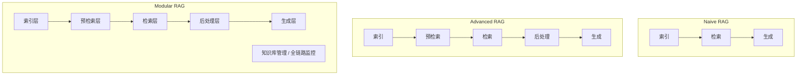
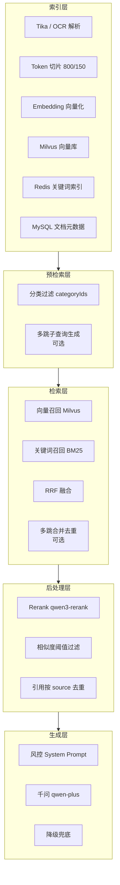
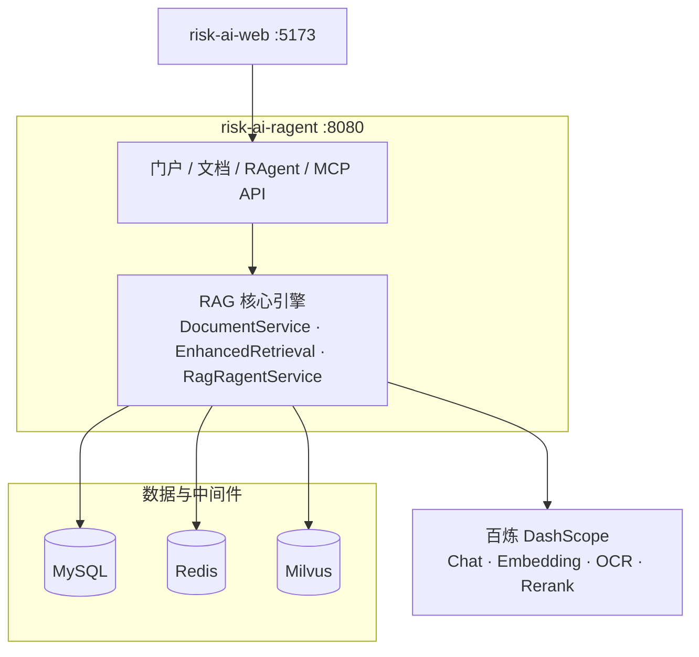

# RAG 架构说明

本文档说明 **Risk AI RAGENT** 在业界常见 RAG 架构分类中的定位，以及本项目各层模块与代码的对应关系。适合面试准备、技术评审和新人 onboarding。

---

## 1. 三大主流 RAG 架构

业界常将 RAG 系统分为三类（由简到繁）：

| 架构 | 典型链路 | 特点 |
|------|----------|------|
| **Naive RAG** | 索引 → 检索 → 生成 | 无优化模块，适合小库 Demo |
| **Advanced RAG** | 索引 → 预检索 → 检索 → 后处理 → 生成 | 有查询扩展、混合检索、重排序、过滤等 |
| **Modular RAG** | 组件解耦、接口标准化、模块可替换 | 企业落地首选，支持路由、多路检索、评估等 |



---

## 2. 本项目属于哪种架构？

**结论：以 Advanced RAG 为主，工程上具备向 Modular RAG 演进的模块拆分，但不是完整的 Modular RAG。**

一句话版本（面试可用）：

> 本项目采用 **Advanced RAG** 架构：文档切片向量化入库后，检索阶段使用 **向量 + 关键词混合召回（RRF 融合）**，后处理阶段使用 **百炼 qwen3-rerank 精排**，最后结合风控 Prompt 生成答案；代码按 Service 分层，具备向 Modular RAG 扩展的基础。

### 对照表

| 能力维度 | Naive | Advanced | Modular | **本项目** |
|----------|-------|----------|---------|------------|
| 向量检索 | ✅ | ✅ | ✅ | ✅ Milvus |
| 关键词 / 混合检索 | ❌ | ✅ | ✅ | ✅ Redis BM25 + RRF |
| Rerank 精排 | ❌ | ✅ | ✅ | ✅ qwen3-rerank |
| 查询扩展 / 多跳 | ❌ | 部分 | ✅ | ✅ 可选 Multi-hop |
| 分类 / 阈值过滤 | ❌ | ✅ | ✅ | ✅ categoryId + similarityThreshold |
| 强约束 Prompt | ❌ | ✅ | ✅ | ✅ 风控防幻觉 |
| 查询改写 / 路由 | ❌ | 部分 | ✅ | ⚠️ 仅多跳子查询 |
| 上下文压缩 | ❌ | 部分 | ✅ | ❌ |
| 分层 / Graph 索引 | ❌ | ❌ | ✅ | ❌ |
| RAG 评估体系 | ❌ | 部分 | ✅ | ⚠️ 仅有 ragent_log |
| 模块可插拔 | ❌ | 部分 | ✅ | ⚠️ Service 拆分，无统一 SPI |

---

## 3. 本项目的 RAG 分层架构

### 3.1 总览



### 3.2 各层与代码映射

| RAG 层 | 职责 | 核心类 |
|--------|------|--------|
| **索引层** | 解析、切片、向量化、建索引 | `DocumentService`、`DocumentParser`、`TokenTextChunker`、`VectorStoreService`、`ChunkIndexService` |
| **预检索层** | 缩小检索范围、扩展查询 | `VectorStoreService.buildCategoryFilter()`、`MultiHopRetrievalService`（子查询） |
| **检索层** | 多路召回与融合 | `VectorStoreService`、`KeywordRetrievalService`、`ReciprocalRankFusion`、`EnhancedRetrievalService`、`MultiHopRetrievalService` |
| **后处理层** | 精排与结果整理 | `DashScopeRerankService`、`EnhancedRetrievalService`、`RagRagentService.toReferences()` |
| **生成层** | Prompt + LLM + 降级 | `RagRagentService` |
| **支撑能力** | 缓存、限流、日志、门户 | `RateLimitAspect`、`RagentLogService`、`ChatSessionService`、MCP `RiskMcpTools` |

---

## 4. 一次问答的完整链路

```
用户提问
  → 鉴权（Redis Token，门户接口）
  → 答案缓存（Redis MD5 Key，含多跳/混合/Rerank 开关）
  → 检索编排
      · 多跳关闭：EnhancedRetrievalService.retrieve()
          ① Milvus 向量召回（candidate-top-k）
          ② Redis BM25 关键词召回（candidate-top-k）
          ③ RRF 融合
          ④ qwen3-rerank 精排 → final top-k
      · 多跳开启：MultiHopRetrievalService 多跳合并
          → EnhancedRetrievalService.refine()（补关键词路 + Rerank）
  → 组装风控 System Prompt + 检索上下文
  → 百炼千问生成回答
  → 写入 chat_message / ragent_log
  → 返回 answer、references、multiHopUsed、hybridRetrievalUsed、rerankUsed 等
```

详见 [混合检索与Rerank指南.md](混合检索与Rerank指南.md)、[多跳检索指南.md](多跳检索指南.md)。

---

## 5. 系统分层架构（工程视角）

除 RAG 链路外，项目还有**四层系统架构**（见 `README.md`）：

| 层级 | 组件 | 职责 |
|------|------|------|
| 展示层 | `risk-ai-web` | Vue 3 管理后台 + 用户问答门户 |
| 应用层 | Spring Boot API | 鉴权、文档管理、问答、MCP |
| 数据层 | MySQL / Redis / Milvus | 元数据、缓存限流、向量与关键词索引 |
| 模型层 | 百炼 DashScope | Chat、Embedding、OCR、Rerank |



---

## 6. 与典型 Demo 的对比

| 维度 | 典型 RAG Demo | Risk AI RAGENT |
|------|---------------|----------------|
| 架构类型 | Naive RAG | **Advanced RAG** |
| 检索 | 单向量 topK | 混合召回 + RRF + Rerank |
| 查询优化 | 无 | 可选多跳子查询 |
| 工程化 | 单接口 | 门户、鉴权、缓存、限流、日志、MCP |
| 可演进性 | 低 | 模块已拆分，可向 Modular 扩展 |

---

## 7. 演进路线（向 Modular RAG）

若继续优化，建议优先级：

| 优先级 | 能力 | 说明 |
|--------|------|------|
| P1 | Query Rewrite | 独立查询改写模块，提升口语化问题召回 |
| P1 | RAG 评估 | Recall@K、MRR、人工标注集 |
| P2 | 上下文压缩 | 长 chunk 压缩后再送 LLM |
| P2 | 流式输出 | SSE 流式返回答案 |
| P3 | 父子块索引 | Parent-Child Chunk，提升定位精度 |
| P3 | 动态检索路由 | 按问题类型选择检索策略 |

---

## 8. 面试常见问题

**Q：你这个项目是什么 RAG 架构？**  
A：Advanced RAG。有混合检索和 Rerank，不是最基础的 Naive；工程上 Service 分层，但还没到完整 Modular。

**Q：为什么需要混合检索？**  
A：纯向量对制度名、条款编号、专业术语容易漏召；BM25 关键词路补足，RRF 融合两路结果。

**Q：Rerank 和 Embedding 检索有什么区别？**  
A：Embedding 负责**召回**（快、广）；Rerank 负责**精排**（准、慢），对 top 候选做语义相关性重排序。

**Q：多跳和混合检索是什么关系？**  
A：多跳解决「跨文档关联」；混合检索解决「单 query 召回质量」。两者可叠加：多跳合并后再走混合 + Rerank。

---

## 相关文档

- [混合检索与Rerank指南.md](混合检索与Rerank指南.md) — 混合检索与 Rerank 配置与排错
- [多跳检索指南.md](多跳检索指南.md) — Multi-hop 原理与配置
- [快速理解代码.md](快速理解代码.md) — 代码阅读路径
- [README.md](../README.md) — 项目总览
