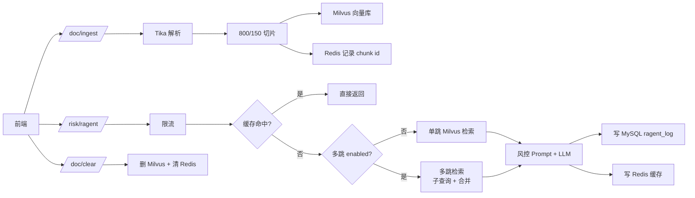

# Risk AI RAGENT — 快速理解代码指南

本文档帮助你在 **30 分钟内** 建立对项目的整体认知。建议按「请求链路」阅读，而不是按包名乱翻。

---

## 1. 先抓三件事（5 分钟）

| 问题 | 去哪看 |
|------|--------|
| 项目是干什么的？ | 项目根目录 `README.md` |
| 有哪些接口？ | `DocController`、`RiskRagentController`、`controller/api/*` |
| MCP / 多跳检索？ | [MCP接入指南.md](MCP接入指南.md)、[多跳检索指南.md](多跳检索指南.md) |
| 用了哪些中间件？ | `pom.xml`、`application.yml`、`docker-compose.yml` |

### 核心对外能力

| 类型 | 路径 / 端点 | 作用 |
|------|-------------|------|
| POST | `/doc/ingest` | 上传主流格式文档，解析入库 |
| GET | `/doc/supported-types` | 支持的文件扩展名 |
| POST | `/risk/ragent` | 风控智能问答（RAG，可选多跳） |
| DELETE | `/doc/clear` | 清空知识库向量 |
| SSE | `/sse` + `/mcp/message` | MCP Server，供 Cursor 等调用 |
| POST | `/api/auth/login` | 门户登录 |
| * | `/api/admin/*`、`/api/user/*` | 管理端 / 用户端 API |

---

## 2. 按「请求链路」读代码（推荐）

不要从包名乱翻，**顺着一次真实请求**看下去。

### 路径 A：文档入库

```
DocController.ingest()
  → DocumentService.ingest()
      → DocumentParser（Tika 办公文档 / 百炼视觉 OCR 图片）
      → TokenTextChunker（800 Token / 150 重叠切片）
      → VectorStoreService.add()（写入 Milvus）
      → Redis 记录 chunk id（供 /doc/clear 使用）
```

**重点文件：**

| 文件 | 说明 |
|------|------|
| `controller/DocController.java` | 接收入参、校验文件 |
| `service/DocumentService.java` | 入库主流程（5 步） |
| `util/DocumentParser.java` | Tika 解析 + 图片 OCR 路由 |
| `util/SupportedDocumentTypes.java` | 允许上传的扩展名校验 |
| `service/ImageTextExtractorService.java` | 百炼视觉模型图片 OCR |
| `util/TokenTextChunker.java` | jtokkit 切片 |
| `service/VectorStoreService.java` | Milvus 向量库封装 |

### 路径 B：风控问答（核心）

```
RiskRagentController.qa() / UserChatController / AdminRagentController
  → @RateLimit（RateLimitAspect 限流）
  → RagRagentService.ask()
      ① Redis 缓存命中？→ 直接返回
      ② MultiHopRetrievalService.retrieve()
           · enabled=false → 单跳 VectorStoreService（与改造前一致）
           · enabled=true  → 多跳：原问题 → 子查询 → 合并去重
      ③ 拼风控 Prompt + 调大模型
      ④ 失败则降级兜底
      ⑤ RagentLogService 写 MySQL 日志
```

**重点文件：**

| 文件 | 说明 |
|------|------|
| `controller/RiskRagentController.java` | 开放问答入口 |
| `aspect/RateLimitAspect.java` | AOP 限流切面 |
| `service/RagRagentService.java` | **最核心**：RAG + Prompt + 缓存 + 降级 |
| `service/MultiHopRetrievalService.java` | 多跳检索（默认关闭） |
| `service/VectorStoreService.java` | 向量相似度检索 |
| `service/RagentLogService.java` | 问答日志落库 |

### 路径 D：MCP 客户端调用

```
Cursor / Claude Desktop
  → GET /sse（SSE 连接）
  → POST /mcp/message
  → RiskMcpTools（@Tool）
      · searchRiskKnowledge  单跳检索
      · askRiskQuestion      完整 RAG（受多跳配置影响）
      · getKnowledgeBaseStats / listKnowledgeCategories
```

**重点文件：**

| 文件 | 说明 |
|------|------|
| `mcp/RiskMcpTools.java` | MCP 工具实现 |
| `config/McpServerConfig.java` | ToolCallbackProvider 注册 |

详见 [MCP接入指南.md](MCP接入指南.md)。

### 路径 C：清空知识库

```
DocController.clear()
  → DocumentService.clearAll()
      → 从 Redis 取所有 chunk id
      → VectorStoreService.delete()
      → 删除 Redis 中的 id 集合
```

---

## 3. 四大模块对应关系

```
模块1 知识库入库     → DocumentService + DocumentParser + TokenTextChunker
模块2 RAG 问答       → RagRagentService + MultiHopRetrievalService + VectorStoreService
模块3 Redis 能力     → RateLimitAspect / RateLimitService（限流）
                       RagRagentService 内 cache / degrade（缓存、降级）
模块4 MySQL 日志     → RagentLog + RagentLogMapper + RagentLogService
模块5 MCP 对外       → RiskMcpTools + McpServerConfig（SSE Server）
```

### 公共支撑层

| 包 | 职责 |
|----|------|
| `common/` | 统一返回 `Result`、业务异常、全局异常处理 |
| `config/` | 跨域、Redis、MyBatis、OpenAPI、`RagProperties` 配置绑定 |
| `dto/` | 请求/响应数据结构 |
| `annotation/` | `@RateLimit` 限流注解 |
| `util/` | Tika 解析、Token 切片、客户端 IP 获取 |

---

## 4. 目录结构速查

```
src/main/java/com/gm/riskaiRagent/
├── RiskAiRagentApplication.java        启动类
├── annotation/                     @RateLimit
├── aspect/                         RateLimitAspect（限流切面）
├── common/                         Result、异常、全局异常处理
├── config/                         全局配置（CORS、Redis、MyBatis、RagProperties、McpServerConfig）
├── controller/                     DocController、RiskRagentController、api/*
├── dto/                            RagentRequest、RagentResponse、MultiHopRetrievalResult 等
├── mcp/                            RiskMcpTools（MCP 工具）
├── entity/                         RagentLog、SysUser、SysDocument 等
├── mapper/                         MyBatis Mapper
├── service/                        RAG、多跳检索、文档、会话、仪表盘等
└── util/                           DocumentParser、SupportedDocumentTypes、TokenTextChunker
```

---

## 5. 配置从哪来

所有可调参数在 `application.yml` 的 `risk-ai.*` 下，由 `config/RagProperties.java` 绑定：

| 配置项 | 默认值 | 说明 |
|--------|--------|------|
| `chunk.size` / `chunk.overlap` | 800 / 150 | Token 切片与重叠 |
| `rag.top-k` | 5 | 单跳检索返回条数 |
| `rag.similarity-threshold` | 0.5 | 相似度阈值 |
| `multi-hop.enabled` | **false** | 是否启用多跳检索 |
| `multi-hop.max-hops` | 2 | 最大跳数 |
| `multi-hop.hop-top-k` / `final-top-k` | 3 / 5 | 每跳 topK / 合并后条数 |
| `document.vision-model` | qwen-vl-plus | 图片 OCR 模型 |
| `document.ocr-prompt` | … | 图片 OCR 提示词 |
| `cache.ttl-minutes` | 60 | 答案缓存时长 |
| `rate-limit.max-requests` / `window-seconds` | 20 / 60 | 限流阈值 |
| `degrade.fallback-answer` | … | 大模型不可用时的兜底文案 |

MCP（`spring.ai.mcp.server.*`）：

| 配置项 | 默认值 | 说明 |
|--------|--------|------|
| `enabled` | true | 是否启用 MCP Server |
| `sse-endpoint` | `/sse` | SSE 连接 |
| `sse-message-endpoint` | `/mcp/message` | 消息端点 |

大模型、MySQL、Redis、Milvus 的地址和密钥均在 `application.yml` 中通过**环境变量占位**，不在 Java 代码里硬编码，例如：

- `OPENAI_API_KEY`、`OPENAI_BASE_URL`
- `MYSQL_HOST`、`MYSQL_USER`、`MYSQL_PASSWORD`
- `REDIS_HOST`、`REDIS_PORT`
- `MILVUS_HOST`、`MILVUS_PORT`

---

## 6. 总流程图



---

## 7. 本地跑起来再对照代码（最快）

```powershell
# 1. 启动中间件
docker compose up -d

# 2. 配置大模型（示例）
$env:OPENAI_API_KEY="sk-xxx"
$env:OPENAI_BASE_URL="https://api.openai.com"

# 3. 使用 JDK 17 启动
$env:JAVA_HOME="F:\tool\jdk-17.0.9"
$env:PATH="$env:JAVA_HOME\bin;$env:PATH"
mvn spring-boot:run
```

然后：

1. 打开 Swagger：<http://localhost:8080/swagger-ui.html>
2. 调用 `POST /doc/ingest` 上传一个 `.txt` 或 `.pdf`
3. 调用 `POST /risk/ragent` 提问
4. 对照 `RagRagentService.ask()` 看日志或打断点

**跑一遍比干看代码快很多。**

---

## 8. 建议阅读顺序（约 30 分钟）

| 顺序 | 文件 | 时间 | 目的 |
|------|------|------|------|
| 1 | `README.md` | 5 min | 技术栈与启动方式 |
| 2 | `DocController` + `RiskRagentController` | 5 min | 三个接口入口 |
| 3 | `RagRagentService` | 10 min | 问答核心逻辑 |
| 4 | `DocumentService` | 5 min | 文档入库流程 |
| 5 | `application.yml` + `RagProperties` | 5 min | 可调参数 |

其余 `common`、`config`、`aspect` 等按需阅读。

---

## 9. 深入阅读（按兴趣选读）

### 只关心「问答怎么答出来的」

1. `RiskRagentController.qa()`
2. `RagRagentService.ask()` — 五步：缓存 → 检索（单跳/多跳）→ LLM → 写缓存 → 写日志
3. `MultiHopRetrievalService.retrieve()` — 多跳逻辑（`enabled=true` 时）
4. `RagRagentService.RISK_SYSTEM_PROMPT` — 风控防幻觉 Prompt
5. `VectorStoreService.similaritySearch()`

### 只关心「文档怎么入库的」

1. `DocController.ingest()` / `AdminDocumentController.upload()`
2. `DocumentService.ingest()` — 校验 → 解析 → 切片 → Milvus → Redis
3. `DocumentParser.parse()` — Tika 或图片 OCR 路由
4. `ImageTextExtractorService` — 百炼视觉 OCR（图片专用）
5. `SupportedDocumentTypes` — 格式白名单
6. `TokenTextChunker.split()` — 800/150 滑窗算法

详见 [文档入库指南.md](文档入库指南.md)。

### 只关心「Redis / MySQL 怎么配合的」

| 能力 | 实现位置 | Redis Key 示例 |
|------|----------|----------------|
| 限流 | `RateLimitAspect` + `RateLimitService` | `risk-ai:ragent:rl:risk-ragent:{ip}` |
| 答案缓存 | `RagRagentService` | `risk-ai:ragent:cache:{md5}` |
| chunk 追踪 | `DocumentService` | `risk-ai:doc:chunk-ids`（Set） |
| 问答日志 | `RagentLogService` → MySQL `ragent_log` | — |

---

## 10. 常见问题

**Q：为什么 Spring Boot 是 3.4.5 而不是 3.2？**  
A：Spring AI 1.0.0 GA 要求 Boot 3.4+；能配 3.2 的 Spring AI 0.8.x 在当前 Maven 镜像环境下载不到。详见 `README.md`「版本说明」。

**Q：风控 Prompt 在哪改？**  
A：`service/RagRagentService.java` 中的 `RISK_SYSTEM_PROMPT` 常量。

**Q：切片规则能改吗？**  
A：改 `application.yml` 中 `risk-ai.chunk.size` 和 `risk-ai.chunk.overlap`，无需改代码。

**Q：接口返回格式是什么？**  
A：统一 `{ "code": 200, "message": "success", "data": {...}, "timestamp": ... }`，见 `common/Result.java`。

**Q：如何开启多跳检索？**  
A：`risk-ai.multi-hop.enabled: true`，详见 [多跳检索指南.md](多跳检索指南.md)。

**Q：MCP 怎么连？**  
A：Cursor 配置 `http://localhost:8080/sse`，详见 [MCP接入指南.md](MCP接入指南.md)。

**Q：支持上传哪些文件？图片怎么检索？**  
A：TXT/PDF/Office/图片等，见 [文档入库指南.md](文档入库指南.md)。图片先 OCR 成文字再向量检索，可配置 `qwen-vl-ocr-latest` 提升扫描件效果。

---

## 相关文档

- [README.md](../README.md) — 项目说明、技术栈、API 示例
- [文档入库指南.md](文档入库指南.md) — 多格式上传、Tika、图片 OCR、模型选型
- [多跳检索指南.md](多跳检索指南.md) — Multi-hop 原理与配置
- [MCP接入指南.md](MCP接入指南.md) — MCP 工具与客户端配置
- [application.yml](../src/main/resources/application.yml) — 全部配置项
- [schema.sql](../src/main/resources/schema.sql) — 建表脚本
