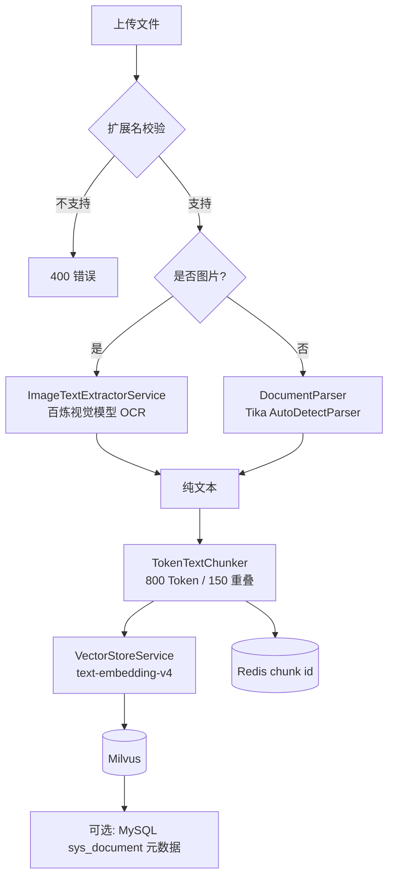

# 文档入库指南（多格式 + 图片 OCR）

本文说明知识库**多格式上传、解析、切片、向量化**的完整逻辑，包括 Office 文档、PDF、纯文本与**图片 OCR**。

> 图片入库后与普通文本一样走向量检索，**不是「以图搜图」**，而是「OCR 成文字 → 切片 → Embedding → Milvus」。

---

## 1. 支持的文件格式

| 类别 | 扩展名 | 解析方式 | `parseMode` |
|------|--------|----------|-------------|
| 纯文本 | txt, md, markdown, csv, json, xml, html, htm, log | Apache Tika | `TIKA` |
| PDF | pdf | Tika | `TIKA` |
| Word | doc, docx, rtf, odt | Tika | `TIKA` |
| Excel | xls, xlsx, ods | Tika | `TIKA` |
| PPT | ppt, pptx, odp | Tika | `TIKA` |
| 电子书 | epub | Tika | `TIKA` |
| 图片 | jpg, jpeg, png, gif, bmp, webp, tif, tiff | 百炼视觉 OCR | `VISION_OCR` |

白名单与校验见 `util/SupportedDocumentTypes.java`。上传不支持的扩展名会返回 `400`。

查询当前支持列表：

```bash
curl http://localhost:8080/doc/supported-types
```

---

## 2. 入库流程



### 调用链（代码）

```
POST /doc/ingest 或 POST /api/admin/documents/upload
  → DocumentService.ingest()
      → SupportedDocumentTypes.validate()
      → DocumentParser.parse(bytes, fileName)
           · 图片 → ImageTextExtractorService.extract()
           · 其他 → Tika AutoDetectParser
      → TokenTextChunker.split()
      → VectorStoreService.add()
      → Redis 记录 chunk id
```

### 入库后如何被检索

图片与 Word/PDF 无区别：OCR/解析得到的**文本片段**写入 Milvus 后，用户提问时走**文本向量相似度检索**，命中对应 `source`（文件名）的 chunk。

---

## 3. 图片 OCR 与模型选择

当前默认使用百炼 **`qwen-vl-plus`**（通用视觉模型），通过同一 `DASHSCOPE_API_KEY` 与 OpenAI 兼容接口调用。

| 模型 | 适用场景 | 说明 |
|------|----------|------|
| `qwen-vl-plus`（默认） | 截图、简单扫描件、制度配图 | 通用看图，能 OCR |
| `qwen-vl-ocr-latest` | 扫描 PDF 截图、表格、版式复杂文档 | **推荐**：百炼专用 OCR，同 Key 只改配置 |
| `qwen-vl-ocr-2025-11-20` | 同上，固定版本 | 生产可锁定版本 |
| `vanchin/deepseek-ocr` | 复杂版式、对表格还原要求高 | 百炼上的 DeepSeek OCR，**非必须** |

**不必单独部署 DeepSeek-OCR 开源权重**，除非你要私有化 GPU 推理。

### 配置示例

`application.yml`：

```yaml
risk-ai:
  document:
    vision-model: qwen-vl-plus          # 或 qwen-vl-ocr-latest / vanchin/deepseek-ocr
    ocr-prompt: |
      你是金融风控文档 OCR 助手。请完整提取图片中的全部可见文字...
```

环境变量覆盖：

```powershell
$env:RISK_AI_VISION_MODEL="qwen-vl-ocr-latest"
```

扫描件、表格多的场景建议优先改为 `qwen-vl-ocr-latest`，无需改 Java 代码。

---

## 4. API

### 开放接口

**入库**

```bash
curl -X POST http://localhost:8080/doc/ingest \
  -F "file=@./风控制度.pdf"
```

**响应字段**（`IngestResponse`）：

| 字段 | 说明 |
|------|------|
| `fileName` | 原始文件名 |
| `docId` | 文档唯一 ID |
| `charCount` / `tokenCount` / `chunkCount` | 字符数、Token 数、切片数 |
| `fileType` | 扩展名（小写，如 `pdf`、`png`） |
| `parseMode` | `TIKA` 或 `VISION_OCR` |

**查询支持格式**

```bash
curl http://localhost:8080/doc/supported-types
```

**清空知识库**

```bash
curl -X DELETE http://localhost:8080/doc/clear
```

### 管理端（需 Token）

```
POST /api/admin/documents/upload
  form: file, categoryId
```

前端 `risk-ai-web` 上传组件 accept 与后端白名单一致，见 `src/constants/documentTypes.js`。

---

## 5. 相关代码

| 文件 | 职责 |
|------|------|
| `util/SupportedDocumentTypes.java` | 格式白名单、`GET /doc/supported-types` 数据 |
| `util/DocumentParser.java` | Tika / 图片 OCR 路由 |
| `service/ImageTextExtractorService.java` | 百炼多模态 OCR |
| `service/DocumentService.java` | 入库主流程 |
| `controller/DocController.java` | `/doc/ingest`、`/doc/supported-types` |
| `config/RagProperties.Document` | `vision-model`、`ocr-prompt` |

---

## 6. 限制与排错

| 现象 | 原因 / 处理 |
|------|-------------|
| `不支持的文件类型` | 扩展名不在白名单，查 `/doc/supported-types` |
| `文档解析结果为空` | PDF/Office 加密、损坏或无可提取文本 |
| `图片识别失败` | 检查 `DASHSCOPE_API_KEY`；确认账号已开通对应视觉/OCR 模型 |
| `invalid header value: "Bearer 你的key"` | Key 仍为占位符，见 [Windows本地启动与排错.md](Windows本地启动与排错.md) §3.13 |
| 用户端无法上传图片 | 设计如此：仅管理端可上传，用户端文字问答检索，见 §3.14 |
| 图片入库慢 | OCR 多调一次大模型，属正常；批量上传注意限流 |
| 上传超过 50MB | 调整 `spring.servlet.multipart.max-file-size` |

### 图片 OCR 前置条件

1. 已配置有效的 `DASHSCOPE_API_KEY`（与聊天、Embedding 相同）
2. 百炼控制台已开通 `vision-model` 对应模型（如 `qwen-vl-plus` 或 `qwen-vl-ocr-latest`）
3. 图片内容清晰、文字可读；纯装饰图可能返回「无文字内容」

---

## 7. 与问答检索的关系

> **谁上传？谁检索？** 仅**管理端**可上传文档（含图片）；**用户端**只能文字提问。图片须先入知识库，用户再通过问答检索 OCR 后的文本。详见 [Windows本地启动与排错.md](Windows本地启动与排错.md) §3.14。

| 环节 | 图片文档 | Word/PDF |
|------|----------|----------|
| 入库 | OCR → 文本切片 | Tika → 文本切片 |
| 检索 | 文本向量 topK | 文本向量 topK |
| 多跳检索 | 同 `risk-ai.multi-hop.enabled` | 同左 |
| MCP `searchRiskKnowledge` | 检索 OCR 后的文本 chunk | 同左 |

---

## 相关文档

- [README.md](../README.md) — 项目总览
- [快速理解代码.md](快速理解代码.md) — 路径 A 文档入库调用链
- [多跳检索指南.md](多跳检索指南.md) — 问答多跳召回
- [Windows本地启动与排错.md](Windows本地启动与排错.md) — 环境与常见错误
