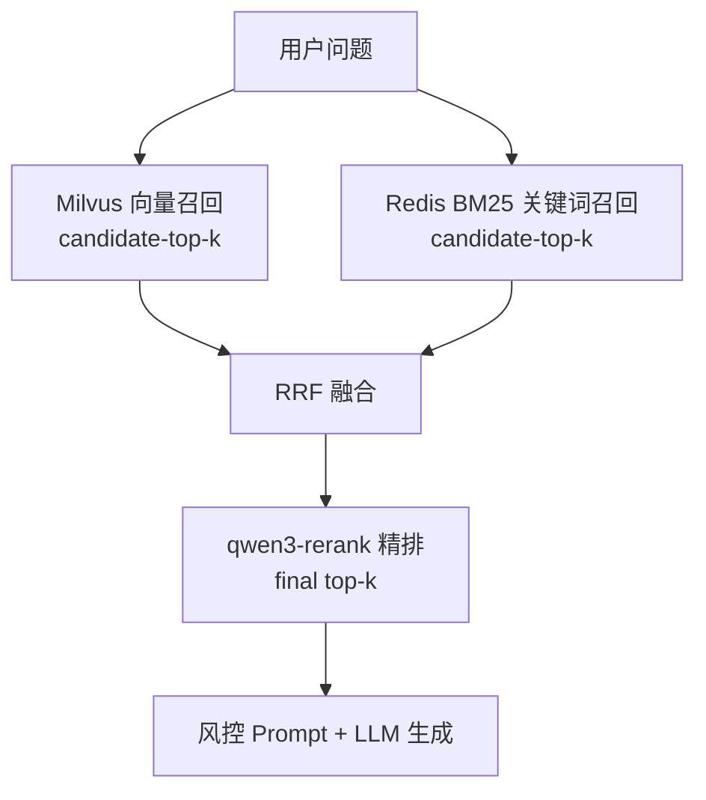

# 混合检索与 Rerank 指南

本项目在向量检索基础上，增加了 **混合检索（Hybrid Retrieval）** 与 **Rerank 精排**，将 RAG 检索链路从「单向量 topK」升级为 **Advanced RAG** 的两阶段检索：**多路召回 → 融合 → 精排**。

> **默认开启**（`risk-ai.retrieval.hybrid.enabled=true`、`risk-ai.retrieval.rerank.enabled=true`）。关闭后回退为纯向量检索行为。

---

## 1. 为什么需要？

| 问题 | 纯向量检索的局限 | 本方案 |
|------|------------------|--------|
| 专业术语、制度编号 | 语义相近但关键词不匹配时易漏召 | BM25 关键词路补足 |
| 召回 topK 有噪声 | 相似度分数不完全等于「对回答问题最有用」 | qwen3-rerank 精排 |
| 风控场景要求可溯源 | 需要更准的上下文片段 | 两阶段检索提升命中率 |

---

## 2. 工作流程

### 2.1 单跳（多跳关闭时）

```
用户问题
    ↓
① 向量召回（Milvus，candidate-top-k=20，默认）
    ↓
② 关键词召回（Redis BM25 索引，candidate-top-k=20）
    ↓
③ RRF 融合（Reciprocal Rank Fusion，rrf-k=60）
    ↓
④ Rerank 精排（百炼 qwen3-rerank，取 final top-k=5）
    ↓
交给 RagRagentService 拼 Prompt + 调大模型
```

### 2.2 多跳开启时

```
用户问题
    ↓
多跳向量检索（原问题 + 子查询，合并去重）
    ↓
EnhancedRetrievalService.refine()
    · 补充关键词路 + RRF 融合
    · Rerank 精排
    ↓
交给 RagRagentService 生成答案
```

详见 [多跳检索指南.md](多跳检索指南.md)。

### 2.3 流程图



---

## 3. 核心组件

| 类 | 职责 |
|----|------|
| `ChunkIndexService` | 入库时将 chunk 文本写入 Redis Hash `risk-ai:chunk:index` |
| `KeywordRetrievalService` | 对索引 chunk 做 BM25 打分召回 |
| `ReciprocalRankFusion` | 向量路与关键词路 RRF 融合 |
| `DashScopeRerankService` | 调用百炼 Rerank API |
| `EnhancedRetrievalService` | 编排混合检索 + Rerank |
| `MultiHopRetrievalService` | 多跳场景下调用 `refine()` 做最终精排 |

### 关键词索引数据结构

入库时每个 chunk 写入 Redis：

```
HSET risk-ai:chunk:index {chunkId} {"text":"...","categoryId":"1","source":"制度.pdf"}
```

删除文档 / 清空知识库时同步删除索引。

---

## 4. 配置项

`application.yml` → `risk-ai.retrieval.*`（由 `RagProperties.Retrieval` 绑定）：

### 混合检索

| 配置 | 默认 | 说明 |
|------|------|------|
| `hybrid.enabled` | **true** | 是否启用混合检索 |
| `hybrid.candidate-top-k` | 20 | 向量/关键词各自召回候选数 |
| `hybrid.rrf-k` | 60 | RRF 平滑常数 k |

### Rerank

| 配置 | 默认 | 说明 |
|------|------|------|
| `rerank.enabled` | **true** | 是否启用 Rerank |
| `rerank.model` | qwen3-rerank | Rerank 模型名 |
| `rerank.base-url` | `https://dashscope.aliyuncs.com/compatible-api/v1/reranks` | API 地址 |
| `rerank.instruct` | Given a web search query... | 排序任务提示（问答检索场景） |
| `rerank.fail-open` | true | API 失败时回退到融合排序，不中断问答 |

### 环境变量

| 变量 | 说明 |
|------|------|
| `DASHSCOPE_API_KEY` | **必填**（与 Chat/Embedding 共用） |
| `RISK_AI_RERANK_MODEL` | 可选，覆盖 `rerank.model` |

### 配置示例

```yaml
risk-ai:
  retrieval:
    hybrid:
      enabled: true
      candidate-top-k: 20
      rrf-k: 60
    rerank:
      enabled: true
      model: qwen3-rerank
      fail-open: true
```

### 仅关闭某一能力

```yaml
# 只要混合检索，不要 Rerank
risk-ai:
  retrieval:
    hybrid:
      enabled: true
    rerank:
      enabled: false

# 只要 Rerank，不要关键词路（回退纯向量 + Rerank）
risk-ai:
  retrieval:
    hybrid:
      enabled: false
    rerank:
      enabled: true
```

---

## 5. API 响应字段

问答接口（`POST /risk/ragent`、门户聊天等）响应 `data` 中新增：

| 字段 | 类型 | 说明 |
|------|------|------|
| `hybridRetrievalUsed` | boolean | 是否使用了混合检索 |
| `rerankUsed` | boolean | 是否使用了 Rerank 精排 |

引用 `references[].score` 在 Rerank 后为精排相关性分数（0~1）。

---

## 6. 与缓存的关系

答案缓存 Key 的 MD5 原文会附加检索策略标记（`|hybrid`、`|rerank`、`|mh`），修改配置后不会命中旧缓存。

---

## 7. MCP 工具影响

| 工具 | 是否走混合检索 + Rerank |
|------|-------------------------|
| `searchRiskKnowledge` | ✅ 是（`EnhancedRetrievalService.retrieve()`） |
| `askRiskQuestion` | ✅ 是（走完整 `RagRagentService.ask()`） |

---

## 8. 历史文档与索引重建

**关键词索引是入库时同步写入的。** 在本次功能上线前已入库的文档，Redis 中没有关键词索引，混合检索的关键词一路为空（仍走向量 + Rerank）。

处理方式（二选一）：

1. **重新上传文档**（推荐）：管理端删除后重新上传，或 `DELETE /doc/clear` 后批量入库。
2. **仅走向量 + Rerank**：临时设 `hybrid.enabled: false`，待重新入库后再开启。

---

## 9. 排错

### Rerank 不生效 / rerankUsed=false

- 检查 `DASHSCOPE_API_KEY` 是否有效
- 检查 `rerank.enabled` 是否为 `true`
- 查看日志：`Rerank API call failed` 表示 fail-open 回退

### 关键词路无结果

- 确认文档是功能上线后重新入库的
- 检查 Redis 中是否存在 `risk-ai:chunk:index` Hash
- 确认 `hybrid.enabled=true`

### 召回变慢

- 调小 `candidate-top-k`（如 15）
- 或关闭 Rerank：`rerank.enabled: false`
- 知识库很大时，关键词路会扫描 Redis 全量索引，可考虑后续做增量索引优化

### Rerank API 404 / 鉴权失败

- 确认 `rerank.base-url` 为 `https://dashscope.aliyuncs.com/compatible-api/v1/reranks`
- 确认账号已开通 `qwen3-rerank` 模型

---

## 10. 代码阅读顺序

1. `EnhancedRetrievalService.retrieve()` — 主编排
2. `KeywordRetrievalService.search()` — BM25 召回
3. `ReciprocalRankFusion.fuse()` — RRF 融合
4. `DashScopeRerankService.rerank()` — 百炼 API 调用
5. `ChunkIndexService` + `DocumentService.ingest()` — 索引写入
6. `MultiHopRetrievalService.retrieve()` — 多跳与精排衔接

---

## 相关文档

- [RAG架构说明.md](RAG架构说明.md) — 项目在三大 RAG 架构中的定位
- [多跳检索指南.md](多跳检索指南.md) — 与多跳的叠加关系
- [快速理解代码.md](快速理解代码.md) — 代码导读
- [README.md](../README.md) — 项目总览
